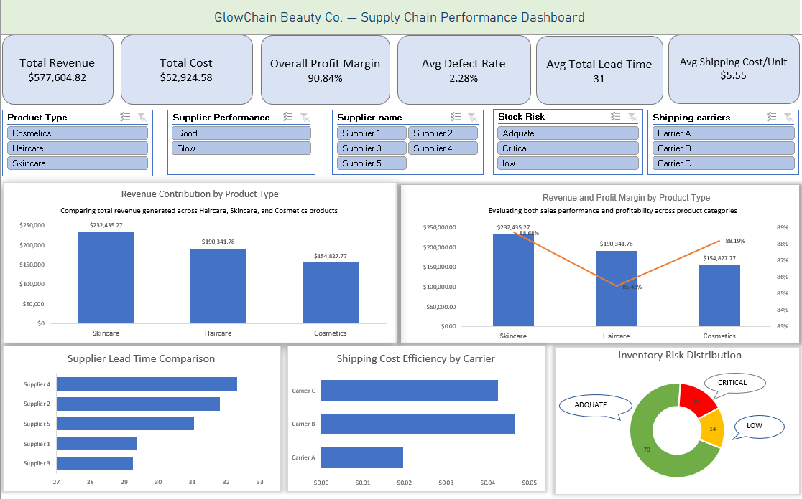

<div align="center">

# 🌿 GlowChain Beauty Co. — Supply Chain Performance Analytics 

<div align="center">

[](https://www.microsoft.com/microsoft-365/excel)


</div>

A polished **end-to-end supply chain analytics project built entirely in Microsoft Excel**.  
It shows how raw operational data can be turned into a clear business story through **data cleaning, feature engineering, KPI design, pivot analysis, and dashboard storytelling**.

</div>

---

## 📌 Overview

GlowChain Beauty Co. is a fictional beauty and skincare company with supply chain data spread across products, suppliers, logistics, and quality checks. This project brings those pieces together in one place and turns them into a management-ready dashboard.

The analysis shows that:

- **Skincare** generates the highest revenue and sells the most units
- **16 SKUs** are at **critical stock risk**
- **Supplier 4** has the longest average lead time and the highest manufacturing cost
- **Carrier A** is the most cost-efficient shipping option on a per-unit basis
- **Haircare** has the highest defect rate among the product categories
- Revenue tiers are driven more by **volume than price**

The final dashboard helps leadership quickly answer the most important questions about stock, suppliers, quality, and logistics.

---

## ✨ Project Highlights

- Built a complete analytics workflow in **Excel only**
- Cleaned and validated raw operational data
- Engineered **7 business-ready calculated fields**
- Created **6 pivot table analyses** and linked charts
- Built an **interactive dashboard with slicers**
- Identified inventory, supplier, logistics, and quality risks
- Converted analysis into practical business recommendations

---

## 📊 Dashboard Preview

<div align="center">



*Interactive executive dashboard for monitoring revenue, inventory risk, supplier performance and logistics efficiency.*

</div>

---

## 🧩 Business Problem

GlowChain Beauty Co. had supply chain data, but no clear operational visibility. Leadership needed a single dashboard to understand:

1. Which products drive the most revenue?
2. Which suppliers are slow or expensive?
3. Which products are close to stockout?
4. Which shipping methods are most efficient?
5. Where are quality defects concentrated?
6. How do price, volume, and margin relate to performance?

This project was designed to answer those questions through a structured analytics workflow.

---

## 📂 Dataset Overview

| Attribute | Details |
|---|---|
| Source | [Kaggle — Supply Chain Dataset by Amir Motefaker](https://www.kaggle.com/datasets/amirmotefaker/supply-chain-dataset/data) |
| **Records** | 100 unique SKUs |
| **Original Columns** | 24 |
| **Final Columns** | 31 |
| **Product Types** | Skincare, Haircare, Cosmetics |
| **Suppliers** | Supplier 1–5 |
| **Shipping Carriers** | Carrier A, B, C |
| **Transport Modes** | Air, Rail, Road, Sea |
| **Locations** | Mumbai, Delhi, Kolkata, Bangalore, Chennai |

---

## 🧹 Data Cleaning

Cleaning was completed in the `clean_data` sheet while preserving the original raw dataset as the source of truth.

### Cleaning steps
- Checked for duplicates
- Verified missing values
- Standardized text fields using `TRIM` and `PROPER`
- Corrected inconsistent casing
- Reviewed numeric columns for invalid values
- Confirmed SKU uniqueness
- Formatted percentage fields correctly
- Performed manual inspection for anomalies

### Result
The dataset was already relatively clean, so the value of this stage was **validation, consistency, and trust in the analysis**.

---

## ⚙️ Feature Engineering

Seven new fields were created to convert raw data into business-ready insights.

### 1. Profit Margin %
Calculated from revenue and cost to show true profitability.

### 2. Stock Risk Flag
Classifies products as **Critical**, **Low**, or **Adequate** based on stock versus order quantity.

### 3. Revenue Tier
Segments products into **High**, **Medium**, and **Low** revenue groups using percentile thresholds.

### 4. Defect Category
Converts raw defect rates into quality labels such as **Excellent**, **Acceptable**, **Concerning**, and **Critical**.

### 5. Total Lead Time
Combines supplier lead time and manufacturing lead time into one end-to-end procurement metric.

### 6. Shipping Cost Per Unit
Normalizes shipping cost by unit volume for fair carrier comparison.

### 7. Supplier Performance Flag
Combines lead time and defect rate into a procurement-focused supplier quality label.

---

## 📈 Key KPI Metrics

The dashboard highlights the following executive metrics:

| KPI | Value |
|---|---:|
| Total Revenue | ₹5,77,604.82 |
| Overall Profit Margin | 90.84% |
| Critical Stock Items | 16 |
| Average Total Lead Time | 30 days |
| Average Defect Rate | 2.28% |
| Slow Supplier Products | 25 |

---

## 🔍 Core Analysis

### Revenue by Product Type
Skincare generated the highest revenue and sold the most units. Cosmetics delivered strong margins despite lower volume, showing that price alone is not the main driver of performance.

### Supplier Performance
Supplier 4 had the longest lead time and highest manufacturing cost. Supplier 1 offered the best balance of low defect rate, acceptable lead time, and strong revenue contribution.

### Inventory Risk
Stock risk is concentrated in Skincare, which also represents the most important revenue category. This makes stockout exposure a direct business risk.

### Logistics Efficiency
Carrier A delivered the best cost-per-unit efficiency. Road transport offered the best balance between speed and cost among the transport modes.

### Quality Performance
Haircare had the highest defect rate, while the inspection results showed a substantial portion of items still pending review. That creates a hidden quality risk.

### Price vs Revenue
Average prices were similar across revenue tiers, which suggests revenue performance is driven more by demand and volume than by pricing differences.

---

## 💡 Key Business Insights

- **Skincare is the revenue leader**, but also the category most exposed to stockout risk
- **Supplier 4 is the weakest supplier** based on lead time and manufacturing cost
- **Carrier A is the most efficient carrier** on a unit-cost basis
- **Haircare requires quality review** due to the highest defect rate
- **Revenue tier is volume-driven**, not price-driven
- **Pending inspections create hidden risk** and should be closed faster

---

## ✅ Recommendations

1. **Restock all critical items immediately**, especially critical Skincare SKUs.
2. **Review Supplier 4** for renegotiation or diversification.
3. **Shift high-volume shipments to Carrier A** where feasible.
4. **Resolve pending quality inspections faster** to reduce hidden risk.
5. **Investigate Haircare costs and defects** to improve margin and quality.
6. **Reassess low-tier products** using both volume and margin contribution.

---

## 🛠️ Tools & Techniques Used

- Microsoft Excel
- Power Query
- Excel Tables
- Pivot Tables
- Pivot Charts
- Slicers
- Conditional Formatting
- Nested IF logic
- AND / IFERROR / COUNTIF / SUMIF
- PERCENTILE-based segmentation
- Dashboard design principles
- Business storytelling with data

---

## 🎓 Skills Demonstrated

### Technical
- Data cleaning and transformation
- Feature engineering
- KPI calculation
- Pivot-based analysis
- Interactive dashboard creation
- Excel-based business intelligence

### Business
- Supply chain analytics
- Inventory risk analysis
- Supplier evaluation
- Logistics cost analysis
- Quality control interpretation
- Insight-driven recommendation writing

---

## 📁 Project Structure

```text
GlowChain_Supply_Chain_Analytics/
│
├── README.md
│
├── assets/
│   └── GlowChain_Dashboard.png
│
└── GlowChain_Supply_Chain_Analysis.xlsx
    ├── Raw_dataset         # Original Kaggle dataset (100 SKUs × 24 columns)
    ├── clean_data          # Cleaned dataset + 7 engineered features
    ├── Calculations        # KPI formulas and supporting metrics
    ├── Analysis sheet      # PT1–PT6 pivot table analysis
    ├── analysis_sheet_2    # Supporting pivot tables and chart sources
    └── dashboard           # Interactive executive dashboard
```

---

## 🔮 Future Improvements

- Add monthly or quarterly time-series data
- Include forecasting with `FORECAST.ETS`
- Expand to order-level transaction analysis
- Add customer segmentation
- Connect to Power BI for live refresh
- Include benchmarking against industry standards
- Add scenario analysis and financial modelling

---

## 🏁 Conclusion

This project shows how a full business intelligence workflow can be built in **Microsoft Excel alone**. It combines cleaning, analysis, feature engineering, and dashboarding into a single decision-support tool for supply chain management.

The final dashboard gives leadership a fast view of revenue, inventory risk, supplier performance, logistics efficiency, and quality concerns — making the project suitable for an entry-level **Data Analyst / Business Analyst portfolio**.

---

## 👤 About

**PRANESH P**  
*Data Analytics Graduate • Building AI & Data Analytics Projects*

🔗 [LinkedIn](https://www.linkedin.com/in/ppranesh2b) 
📧 [Email](mailto:ppranesh2b@gmail.com)
